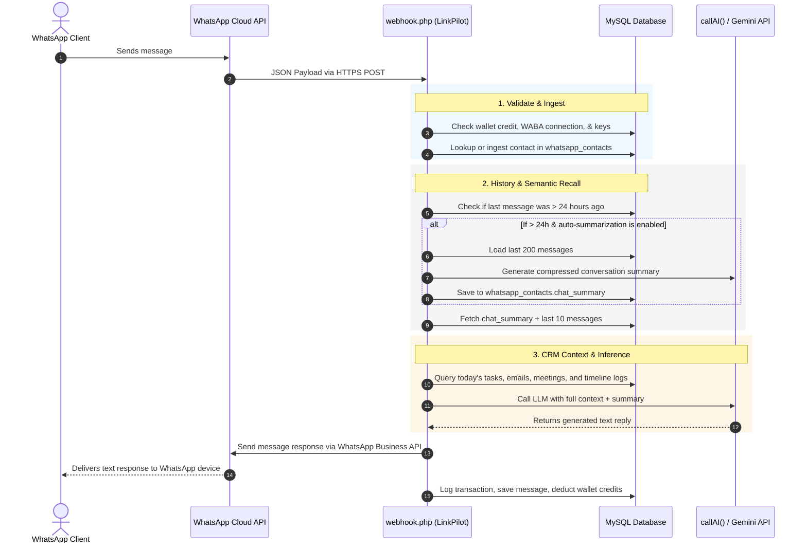

# WhatsApp AI Automation - System Architecture & Workflows

This document outlines the end-to-end architecture, database schema, data pipelines, and UI integrations that power the WhatsApp AI Autopilot system in LinkPilot CRM.

---

## 1. High-Level Architectural Flow

---

## 2. Database Schema

The system relies on three core tables to orchestrate settings, track contacts, and log message history.

### A. Settings Table: `whatsapp_settings`
Manages workspace-wide automation and behavior configurations.
* `user_id` (INT, Primary Key): Unique workspace owner.
* `autopilot_enabled` (TINYINT): Switches global automatic AI replies ON/OFF.
* `auto_summarize_history` (TINYINT): Enables/disables the infinite semantic memory summarizer.
* `auto_crm_creation` (TINYINT): Automatically creates Lead Vault profiles for unknown texters.
* `auto_lead_detection` (TINYINT): Scores lead priority and budgets in real-time.

### B. Contact Ledger Table: `whatsapp_contacts`
Tracks client numbers, names, and persistent context summaries.
* `phone_number` (VARCHAR, Primary Key): Client identifier.
* `name` (VARCHAR): User nickname or parsed name.
* `chat_summary` (TEXT): Consolidated, compressed conversation history summary.
* `last_message_time` (TIMESTAMP): Tracked to detect inactivity windows.

### C. Message History Table: `whatsapp_messages`
Stores the raw conversation script.
* `id` (INT, Primary Key): Auto-incrementing identifier.
* `phone_number` (VARCHAR): Matches client contact record.
* `sender` (ENUM('user', 'bot')): Identifies who sent the message.
* `message_text` (TEXT): Content of the message.
* `created_at` (TIMESTAMP): Precise time of the transaction.

---

## 3. Webhook Pipeline Workflow (`webhook.php`)

When an incoming message payload hits the endpoint:

1. **Security & Validation Checks**:
   - Validates the WhatsApp token handshake.
   - Parses the JSON webhook envelope.
2. **Account Checks**:
   - Resolves the business owner (`user_id`).
   - Queries `admin_settings` for credit balance. If balance is $\le 0$, execution halts.
3. **Autopilot State Resolution**:
   - Queries `whatsapp_settings` for `autopilot_enabled`. If disabled, logs message as a passive thread in the inbox and exits.
4. **CRM Profile Ingestion**:
   - If contact is new and `auto_crm_creation` is ON, creates a profile inside `lead_vault`.
5. **Context Aggregation**:
   - Fetches the persistent `chat_summary` block.
   - Fetches workspace logs: Today's tasks, meetings calendar, outreach email drafts, and CRM timelines.
   - Fetches the last 10 messages in their raw form to maintain conversational flow.
6. **AI Response Construction**:
   - Combines system prompts, CRM context, persistent summary, and message history.
   - Invokes `callAI()`.
   - Sends the response payload to the recipient and saves the log in `whatsapp_messages`.

---

## 4. Persistent Chat Summary System

To provide infinite context memory without exceeding token limits or inflating bills, the system splits memory into **Short-term** (last 10 raw messages) and **Long-term** (compiled summary).

### Auto-summarization Trigger
- Triggers automatically inside `webhook.php` when a new message is received **after 24 hours of inactivity** (based on `last_message_time`).
- The system loads up to the last 200 messages for that user.
- Calls Gemini to write a summary detailing:
  - Key discussion topics.
  - Resolved items or questions.
  - Current pending tasks or next steps.
- Saves the result inside `whatsapp_contacts.chat_summary`.

### Manual "Optimize Summary" Trigger
- CRM agents can manually optimize summaries on-demand by clicking the **Sparkle** button in the Inbox UI, which calls `summarize_chat.php`.

---

## 5. Live Top Bar Indicator Bar

The top header features a real-time status pill `header-autoreply-status-container` checking system readiness:

* **🟢 Auto-Reply Live**: Displays when Autopilot is toggled ON, WhatsApp is connected, credit balance is positive, and AI developer keys are fully validated.
* **🔴 Auto-Reply Inactive**: Displays on connection errors or credit drops. Clicking the badge opens a modal popover detailing the exact reason and includes a **"Fix That"** shortcut redirecting users to:
  - Autopilot toggle ➔ **WhatsApp Settings**
  - Disconnected numbers ➔ **WhatsApp Settings**
  - Insufficient balance ➔ **Billing & Recharge Panel**
  - Paused/Missing developer keys ➔ **Profile Tab**
